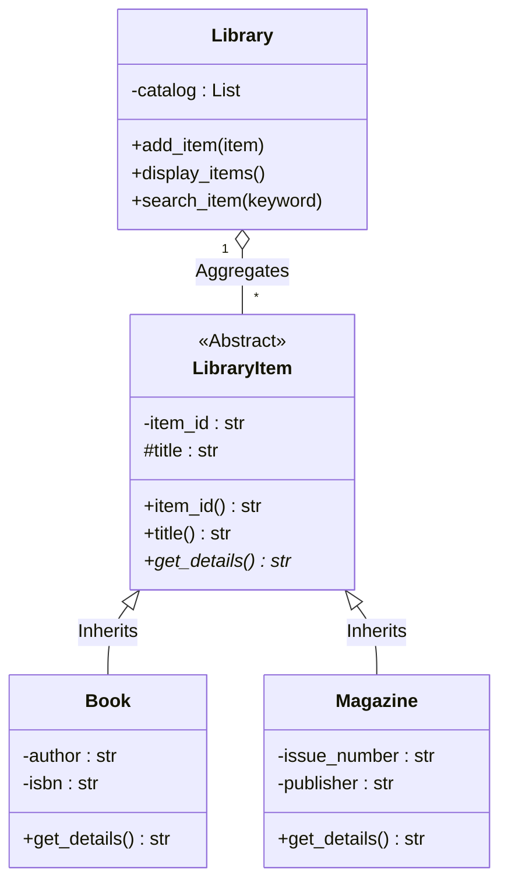

## Fitur Utama
Sistem ini memiliki kapabilitas sebagai berikut:
1.  **Add Item**: Menambahkan item baru (Buku atau Majalah) ke dalam koleksi.
2.  **List Items**: Menampilkan seluruh daftar koleksi dengan detail spesifik sesuai tipe item.
3.  **Search**: Mencari item berdasarkan kata kunci (Judul atau ID) secara *case-insensitive*.

## Arsitektur Class (Class Diagram)
Berikut adalah struktur relasi antar class dalam program ini:


## Class
Abstract Class: LibraryItem bertindak sebagai blueprint dasar menggunakan modul abc. Class ini tidak bisa diinstansiasi sendiri.
Inheritance: Class Book dan Magazine mewarisi properti dan method dari LibraryItem, namun memiliki atribut unik masing-masing (seperti isbn pada buku dan issue_number pada majalah).
Access Modifiers:
__item_id (Private): Menggunakan double underscore agar tidak bisa diakses atau diubah langsung dari luar class.
_title (Protected): Menggunakan single underscore, dapat diakses oleh subclass.
Property Decorator: Menggunakan @property pada item_id untuk memberikan akses baca (read-only) ke atribut private.
Method get_details() didefinisikan sebagai abstract method di parent class.
Subclass Book dan Magazine melakukan override terhadap method tersebut dengan implementasi format string yang berbeda.
Saat Library memanggil display_items(), program secara otomatis menggunakan method yang sesuai dengan tipe objeknya.
```
```
## Cara Menjalankan Program
python tugas.py
```
